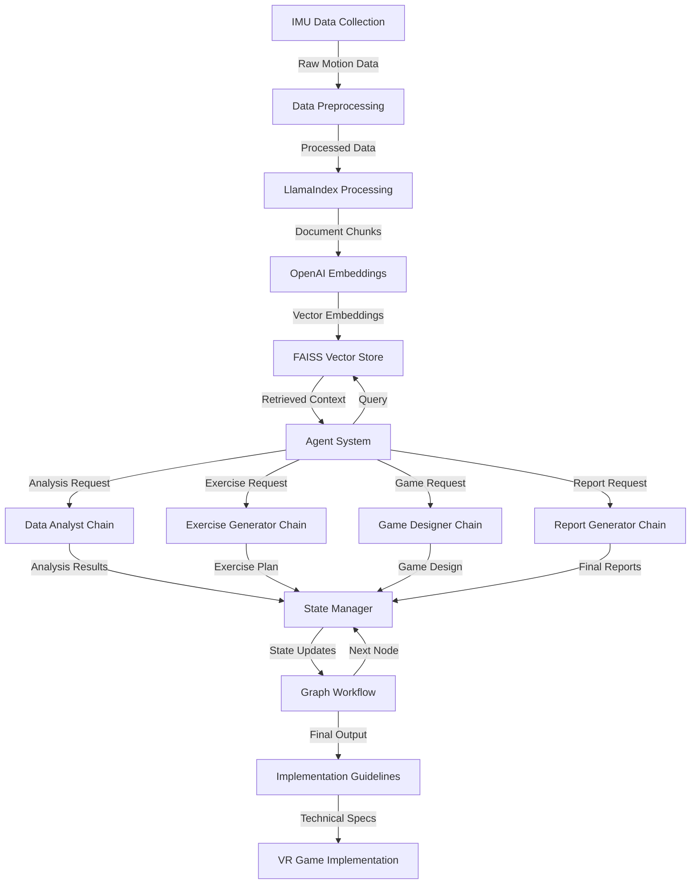

# AI-Powered VR Exercise System Architecture

## Use Case & Problem Statement

This system addresses several key challenges in VR-based exercise and rehabilitation:

1. **Personalized Exercise Analysis**: Traditional VR exercise systems lack personalized feedback based on actual movement data.
2. **Complex Motion Pattern Analysis**: Analyzing bilateral hand movements and coordination patterns requires sophisticated data processing.
3. **Adaptive Exercise Programming**: Exercise routines need to adapt based on user performance and progress.
4. **Engaging VR Game Design**: Creating engaging VR games that maintain therapeutic value while being entertaining.

The system solves these problems by:
- Processing IMU data to understand user movement patterns
- Using AI to analyze motion data and generate personalized exercise recommendations
- Creating engaging VR game mechanics that incorporate therapeutic exercises
- Providing detailed implementation guidelines for VR game development

## High-Level Architecture

```ascii
+------------------+     +-------------------+     +----------------------+
|                  |     |                   |     |                      |
|   IMU Data       |---->|   Agent System    |---->|   Exercise Program   |
|   Collection     |     |   (LangGraph)     |     |   Generation         |
|                  |     |                   |     |                      |
+------------------+     +-------------------+     +----------------------+
                              |
                              |
                              v
+------------------+     +-------------------+     +----------------------+
|                  |     |                   |     |                      |
|   Vector Store   |<--->|   LlamaIndex      |<--->|   OpenAI Embeddings  |
|   (FAISS)        |     |   Processing      |     |   & LLM              |
|                  |     |                   |     |                      |
+------------------+     +-------------------+     +----------------------+
                              |
                              |
                              v
+------------------+     +-------------------+
|                  |     |                   |
|   VR Game        |<----|   Implementation  |
|   Implementation |     |   Guidelines      |
|                  |     |                   |
+------------------+     +-------------------+
```

## Low-Level Component Architecture

```ascii
                                    +------------------------+
                                    |      IMU Data          |
                                    |------------------------|
                                    | - Acceleration         |
                                    | - Gyroscope           |
                                    | - Timestamp           |
                                    +------------------------+
                                             |
                                             v
+------------------+     +-------------------+     +----------------------+
|  LlamaIndex      |     |   Agent System    |     |    OpenAI           |
|------------------|     |-------------------|     |----------------------|
| - Document Store |     | - Data Analyst    |     | - Text Embeddings   |
| - Vector Index   |<--->| - Exercise Gen    |<--->| - Chat Completions  |
| - Query Engine   |     | - Game Designer   |     | - Function Calling  |
+------------------+     | - Report Gen      |     +----------------------+
                        +-------------------+
                                |
                                v
+------------------+     +-------------------+     +----------------------+
|  FAISS Index     |     |   LangGraph       |     |    Chain Components |
|------------------|     |-------------------|     |----------------------|
| - Vector Storage |<--->| - State Manager   |<--->| - Prompt Templates  |
| - KNN Search     |     | - Graph Workflow  |     | - LLM Chains       |
| - Index Mgmt     |     | - Node Processing |     | - Output Parsers   |
+------------------+     +-------------------+     +----------------------+
```

## Detailed Component Flow (Mermaid)



## Agentic RAG System Details

Our implementation uses an advanced Agentic RAG architecture that combines LangGraph for workflow management with LlamaIndex for efficient data retrieval. Here's the detailed breakdown:

### 1. Data Ingestion and Vectorization
```ascii
+------------------+     +-------------------+     +------------------+
|   IMU Data       |     |   Vector Store    |     |    Embeddings    |
|   Collection     |     |   Setup           |     |    Generation    |
|------------------|     |-------------------|     |------------------|
| - Raw Motion Data|---->| - FAISS Index    |---->| - OpenAI API    |
| - Timestamps     |     | - Document Store  |     | - Vector Dims   |
| - Hand Position  |     | - Chunk Size: 512|     | - Batch Process |
+------------------+     +-------------------+     +------------------+
```

The system starts by:
1. Collecting IMU data from VR controllers
2. Processing data into chunks using LlamaIndex
3. Generating embeddings via OpenAIEmbeddings
4. Storing vectors in a FAISS index for efficient retrieval

### 2. Agent System Implementation
```ascii
+------------------------+     +-------------------------+     +------------------------+
|      START Node        |     |    Data Analyst Chain   |     |  Exercise Generator   |
|------------------------|     |-------------------------|     |------------------------|
| - Initial State Setup  |---->| - Motion Pattern       |---->| - Exercise Planning   |
| - Vector Store Access  |     | - Bilateral Analysis   |     | - Progression Design  |
+------------------------+     +-------------------------+     +------------------------+
            |                            |                             |
            |                            v                             v
+------------------------+     +-------------------------+     +------------------------+
|   Implementation Gen   |<----| Report Generator Chain  |<----| Game Designer Chain   |
|------------------------|     |-------------------------|     |------------------------|
| - Technical Details    |     | - Progress Tracking    |     | - Game Mechanics      |
| - VR Implementation   |     | - Exercise Summary     |     | - Interaction Design  |
+------------------------+     +-------------------------+     +------------------------+
```

Our agent system uses LangGraph to:
1. Manage state transitions between agents
2. Maintain context throughout the workflow
3. Ensure proper sequencing of analysis and generation tasks

### 3. Chain Architecture

```mermaid
graph TD
    subgraph "Agent System Workflow"
        A[START] -->|Initialize| B[Data Analysis]
        B -->|Analysis Results| C[Exercise Generation]
        C -->|Exercise Plan| D[Game Design]
        D -->|Game Mechanics| E[Routine Planning]
        E -->|Complete Plan| F[Report Generation]
        F -->|Summary| G[Implementation Details]
    end

    subgraph "Chain Components"
        H[ChatPromptTemplate] -->|Format| I[LLM]
        I -->|Process| J[Output Parser]
        J -->|Structure| K[Next Chain]
    end

    subgraph "State Management"
        L[AgentState] -->|Update| M[State Manager]
        M -->|Retrieve| N[Next Node]
        N -->|Process| L
    end
```


Each chain in our system:
1. Uses ChatPromptTemplate for consistent prompting
2. Processes data through OpenAI's LLM
3. Updates the shared state via LangGraph

### 4. State Management Implementation
```python
class AgentState(TypedDict):
    motion_data: str
    analysis: str
    exercise_suggestions: str
    game_design: str
    exercise_routine: str
    exercise_summary: str
    game_implementation: str
```

The state management:
1. Tracks progress through the workflow
2. Maintains context between chain executions
3. Ensures data consistency across agents

### 5. Chain Creation Pattern
```ascii
+-------------------+     +------------------+     +------------------+
|  Template Design  |     |   Chain Setup    |     |  State Update    |
|-------------------|     |------------------|     |------------------|
| - Role Definition |---->| - Prompt + LLM   |---->| - Content Extract|
| - Task Structure  |     | - Pipe Operator  |     | - State Dict     |
| - Input Format    |     | - Error Handling |     | - Next Node      |
+-------------------+     +------------------+     +------------------+
```

Our implementation uses a consistent pattern for each chain:
```python
def create_X_chain(self):
    template = """[Role and Task Definition]
    {input_variables}
    [Specific Instructions]"""
    
    prompt = ChatPromptTemplate.from_template(template)
    return prompt | self.llm
```

### 6. End-to-End Flow
```ascii
┌─────────────────┐     ┌─────────────────┐     ┌─────────────────┐
│   Data Input    │     │  Agent System   │     │    Output       │
│                 │     │                 │     │                 │
│ - IMU Data      │────>│ - Analysis      │────>│ - Exercise Plan │
│ - Parameters    │     │ - Generation    │     │ - Game Design   │
│ - Context       │     │ - Planning      │     │ - Implementation│
└─────────────────┘     └─────────────────┘     └─────────────────┘
         │                      │                        │
         │                      │                        │
         v                      v                        v
┌─────────────────┐     ┌─────────────────┐     ┌─────────────────┐
│  Vector Store   │     │   LangGraph     │     │    Reports      │
│                 │     │                 │     │                 │
│ - FAISS Index   │<───>│ - Workflow      │────>│ - Summary       │
│ - Embeddings    │     │ - State Mgmt    │     │ - Technical Doc │
└─────────────────┘     └─────────────────┘     └─────────────────┘
```

Key Features of Our Implementation:
1. **Modular Design**: Each chain is independent but works cohesively
2. **State Persistence**: Comprehensive state management across the workflow
3. **Flexible Architecture**: Easy to add new chains or modify existing ones
4. **Error Handling**: Robust error handling at each stage
5. **Scalability**: Can handle increasing data volumes and complexity

The system demonstrates the power of Agentic RAG by:
- Combining retrieval-based context with generative capabilities
- Maintaining coherent state across multiple specialized agents
- Producing structured, contextually relevant outputs
- Enabling complex workflows with clear state transitions
- Supporting iterative refinement of outputs
