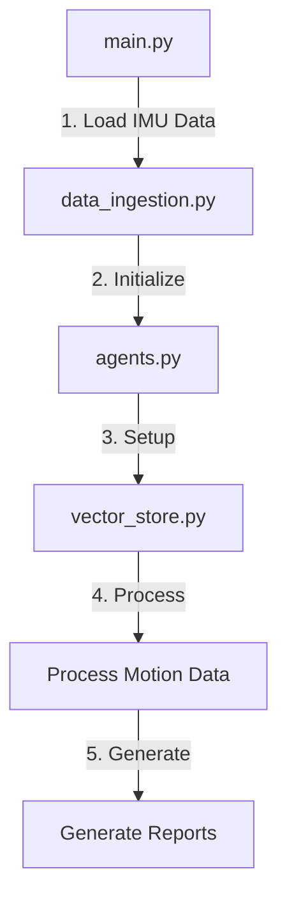
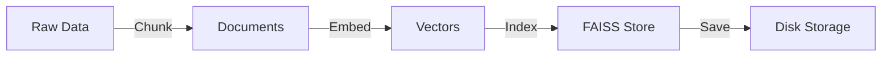
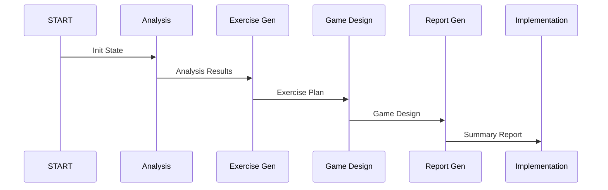
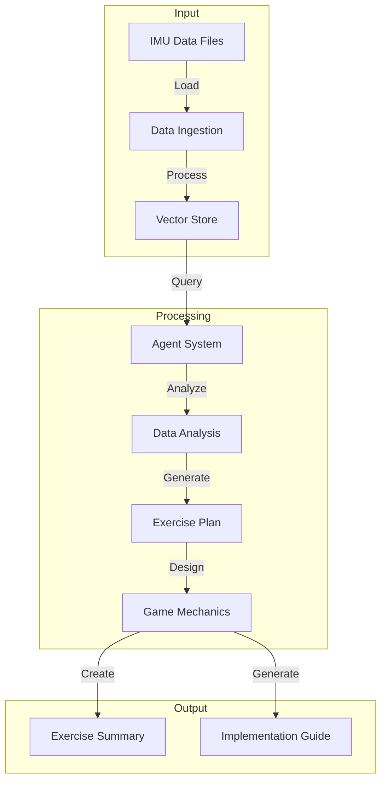

# Code Walkthrough: AI-Powered VR Exercise System

## System Overview

The system processes IMU data from VR controllers to generate personalized exercise routines and VR game implementations. Here's a detailed walkthrough of how the code works:

## 1. Entry Point (`main.py`)



The system starts in `main.py`:
1. Loads IMU data from JSON files
2. Initializes the agent system
3. Sets up the vector store
4. Processes motion data
5. Generates exercise and implementation reports

## 2. Data Ingestion (`data_ingestion.py`)

```ascii
+------------------+     +-------------------+     +------------------+
|   JSON Files     |     |   Data Loading    |     |  Preprocessed    |
|   (IMU Data)     |---->|   & Cleaning      |---->|  Motion Data     |
|                  |     |                   |     |                  |
+------------------+     +-------------------+     +------------------+
```

Key Functions:
- `load_imu_data()`: Reads JSON files containing IMU data
- `preprocess_data()`: Cleans and formats the data
- `combine_hand_data()`: Merges left and right hand data

## 3. Vector Store Setup (`vector_store.py`)

```python
def setup_vector_store():
    """
    1. Initialize FAISS index
    2. Create document store
    3. Generate embeddings
    4. Save vector store
    """
```



## 4. Agent System (`agents.py`)

The agent system uses LangGraph for workflow management:

```ascii
┌─────────────────┐     ┌─────────────────┐     ┌─────────────────┐
│    START Node   │     │  Agent Chains    │     │   Final State   │
│                 │     │                 │     │                 │
│ - Init State    │────>│ 1. Analysis     │────>│ - Analysis      │
│ - Vector Store  │     │ 2. Exercise Gen │     │ - Exercise Plan │
│                 │     │ 3. Game Design  │     │ - Game Design   │
└─────────────────┘     └─────────────────┘     └─────────────────┘
```

### 4.1 Chain Creation Pattern

Each chain follows this pattern:
```python
def create_X_chain(self):
    template = """[Role Definition]
    {input_variables}
    [Task Instructions]"""
    
    prompt = ChatPromptTemplate.from_template(template)
    return prompt | self.llm
```

### 4.2 Workflow Steps



## 5. Chain Implementations

### 5.1 Data Analyst Chain
Analyzes motion patterns:
```ascii
Input: IMU Data
│
├─> Bilateral Analysis
│   └─> Timing, Range, Symmetry
│
├─> Movement Parameters
│   └─> Speed, Acceleration
│
└─> Quality Indicators
    └─> Smoothness, Consistency
```

### 5.2 Exercise Generator Chain
Creates exercise routines:
```ascii
Input: Analysis Results
│
├─> Exercise Planning
│   └─> Types, Progression
│
├─> Safety Guidelines
│   └─> Limits, Precautions
│
└─> Performance Metrics
    └─> Goals, Tracking
```

### 5.3 Game Designer Chain
Designs VR game mechanics:
```ascii
Input: Exercise Plan
│
├─> Game Mechanics
│   └─> Core Gameplay
│
├─> Interaction Design
│   └─> Controls, Feedback
│
└─> Progression System
    └─> Levels, Difficulty
```

## 6. State Management

The system maintains state using TypedDict:
```python
class AgentState(TypedDict):
    motion_data: str       # Raw IMU data
    analysis: str         # Motion analysis
    exercise_suggestions: str  # Exercise plan
    game_design: str      # Game mechanics
    exercise_routine: str  # Complete routine
    exercise_summary: str  # Final summary
    game_implementation: str  # Technical details
```

## 7. Output Generation

Final outputs are generated in two files:

### 7.1 Exercise Summary (`exercise_summary.md`)
```ascii
+------------------+
| Exercise Program |
|-----------------|
| 1. Analysis     |
| 2. 10-Day Plan  |
| 3. Progression  |
| 4. Metrics      |
+------------------+
```

### 7.2 Game Implementation (`game_implementation.md`)
```ascii
+------------------+
| Implementation   |
|-----------------|
| 1. System Reqs  |
| 2. Game Design  |
| 3. Technical    |
| 4. Deployment   |
+------------------+
```

## 8. Complete Data Flow



## 9. Error Handling

The system implements error handling at multiple levels:
1. Data validation in data ingestion
2. State verification in agent system
3. Chain execution error handling
4. Output validation

## 10. Extension Points

The system can be extended by:
1. Adding new chain types
2. Modifying state management
3. Enhancing vector store capabilities
4. Adding new output formats

## Usage Example

```python
# Initialize system
agent_system = AgentSystem()

# Process motion data
results = agent_system.process_motion_data(motion_data)

# Access results
analysis = results["analysis"]
exercise_plan = results["exercise_suggestions"]
game_design = results["game_design"]
```

This walkthrough covers the complete flow from data ingestion to final output generation, showing how each component interacts with others in the system.
